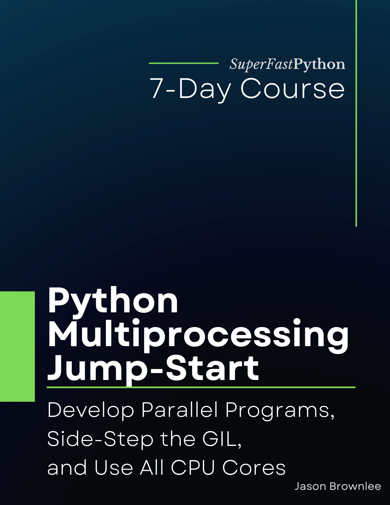

# Python Multiprocessing Jump-Start

* <https://github.com/SuperFastPython/PythonMultiprocessingJumpStart>

This repository provides all source code for the book:

* **Python Multiprocessing Jump-Start**: _Develop Parallel Programs, Side-Step the GIL, and Use All CPU Cores_, Jason Brownlee, 2022.

## Source Code
You can access all Python .py files directly here:

* [src/](src/)

### Book Blurb

> Unlock parallel Python programming (and run your code on all CPUs).
>
> The multiprocessing module provides easy-to-use process-based concurrency in Python.
>
> Unlike Python threading, multiprocessing side-steps the infamous Global Interpreter Lock (GIL), allowing full parallelism in Python.
>
> This is not some random third-party library, this is an API provided in the Python standard library (already installed on your system).
>
> This is the API you need to use to make your code run faster.
>
> There's just one problem. Few developers know about it (or how to use it well).
>
> Introducing: "Python Multiprocessing Jump-Start". A new book designed to teach you the multiprocessing module in Python, super fast!
>
> You will get a fast-paced, 7-part course to get you started and make you awesome at using the multiprocessing API.
>
> Each of the 7 lessons was carefully designed to teach one critical aspect of the multiprocessing module, with explanations, code snippets and worked examples.
>
> Each lesson ends with an exercise for you to complete to confirm you understand the topic, a summary of what was learned, and links for further reading if you want to go deeper.
>
> Stop copy-pasting code from StackOverflow answers.
>
> Learn Python concurrency correctly, step-by-step.
